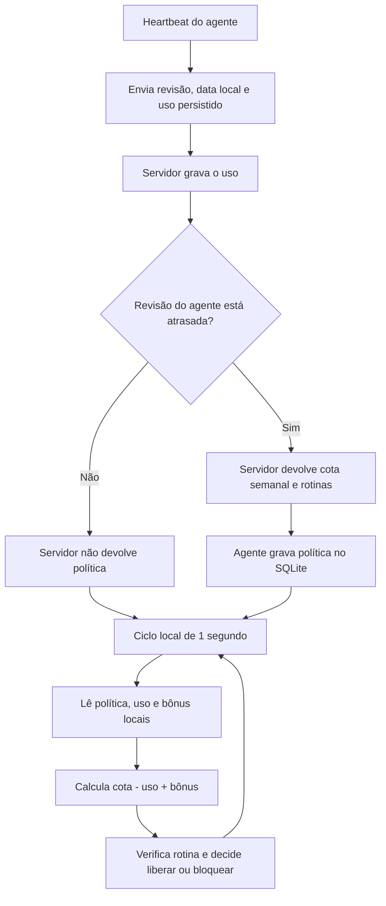
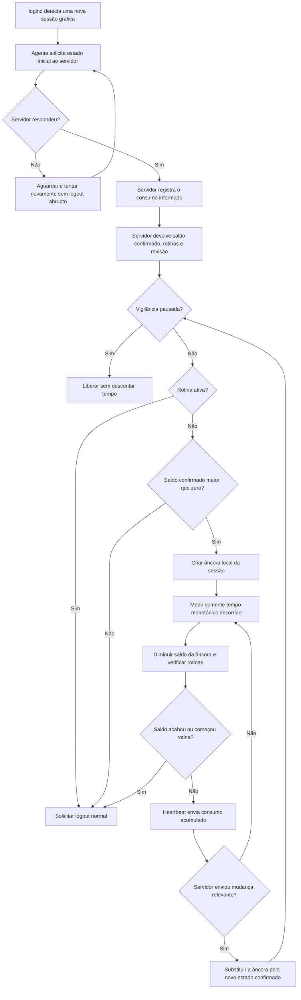

# Revisão do fluxo agente–servidor

Status: fluxo implementado e validado por testes automatizados; ensaio real
ponta a ponta ainda pendente antes de distribuir outro pacote do agente.

## Problema encontrado

O protocolo atual não entrega um saldo pronto ao agente. O heartbeat devolve
uma política com cota semanal, rotinas e comandos. O agente grava política,
consumo e bônus no SQLite e executa novamente o cálculo
`cota do dia - consumo + bônus` em cada ciclo.

Esse desenho transforma a cópia local da política em uma segunda calculadora
de saldo. Ele não corresponde ao fluxo esclarecido: o servidor confirma o
saldo uma vez para autorizar a sessão; depois o agente acompanha somente o
tempo decorrido e a entrada em rotinas.

## Fluxo anterior, substituído



Consequências do fluxo atual:

- o servidor não informa `remaining_seconds` ao agente;
- o agente conhece e recalcula a cota total;
- SQLite funciona como estado operacional e também como entrada para uma nova
  apuração de saldo;
- heartbeat sem mudança de revisão não confirma explicitamente qual é o saldo
  autorizado naquele login.
- o heartbeat não informa se existe uma sessão gráfica ativa. O servidor usa
  apenas `agente online` para decidir que o contador do painel está correndo,
  embora essas condições sejam diferentes.

## Evidência do teste real com o pilot6

- [x] Às 04:00:31, o agente registrou `quota_exhausted`, `session=true` e saldo
  zero.
- [x] Às 04:00:43, registrou `session=false`: o encerramento abrupto removeu a
  sessão gráfica e deixou o Plasma em tela preta.
- [x] Às 04:01:22, recebeu saldo de 600 segundos, mas já não havia sessão
  gráfica para consumir esse tempo.
- [x] `loginctl list-sessions` confirmou somente `tty3` e a sessão `manager`,
  sem sessão `x11` ou `wayland`.
- [x] O painel continuou animando o contador porque tratava heartbeat online
  como uso ativo, apesar de o próprio agente informar `session=false` somente
  em seu log local.
- [x] O agente foi parado e desabilitado. O comando separado de reinício do
  display manager encerrou a sessão gráfica; esse logout pertence ao reinício
  administrativo do SDDM, não ao `systemctl disable --now` do agente.
- [x] Introspecção sem logout confirmou no Debian 13 KDE os métodos
  `org.kde.Shutdown.logout`, `logoutAndReboot`, `logoutAndShutdown` e
  `saveSession` disponíveis no D-Bus da sessão do usuário.
- [x] A ponte genérica `systemd-run --user --machine=<conta>@.host` alcançou o
  D-Bus da sessão com código de saída zero, sem provocar logout.
- [x] O binário portátil `compasso-session-logout -probe` usou essa ponte no
  Debian 13 KDE, descobriu o adaptador disponível e terminou com sucesso sem
  alterar a sessão.
- [x] A chamada real do helper encerrou ordenadamente a sessão KDE e retornou
  ao SDDM; após nova autenticação, o desktop abriu normalmente, sem tela preta.

## Fluxo proposto



## Responsabilidade de cada componente

| Componente | Responsabilidade |
|---|---|
| Servidor | Autoridade sobre cota, bônus remoto, pausa, bloqueio e cálculo do saldo confirmado no início da sessão. |
| Agente | Medir tempo decorrido com relógio monotônico, verificar rotinas e aplicar logout seguro. |
| SQLite local | Guardar a última âncora confirmada, consumo ainda não enviado e rotinas para reinício ou queda de rede; não criar uma fonte independente de saldo. |
| Heartbeat | Enviar consumo, presença de sessão gráfica e eventos; devolver estado completo somente na autorização inicial ou quando algo relevante mudar. |
| Painel | Mostrar o estado do servidor e enviar alterações; não participar da contagem do agente. |

## Estado inicial entregue ao agente

O servidor deve fornecer uma estrutura equivalente a:

```text
revisao_estado
identificador_sessao
data_local
saldo_confirmado_segundos
uso_confirmado_segundos
confirmado_em
```

Vigilância, bloqueio manual, rotinas e aviso permanecem na política revisionada;
não são duplicados dentro da âncora de saldo.

O agente cria uma âncora com `saldo_confirmado_segundos` e `confirmado_em`.
Durante a sessão, o saldo operacional é apenas:

```text
saldo_confirmado_segundos - tempo_monotonico_decorrido
```

Não há nova leitura de cota nem recálculo de saldo a cada segundo.

## Comunicação depois da autorização

O heartbeat continua periódico porque precisa:

- enviar consumo e eventos locais;
- receber bônus, pausa, bloqueio, alteração de rotina ou nova cota;
- informar presença online;
- distinguir `agente online` de `sessão gráfica ativa`, para o painel não
  apresentar consumo inexistente;
- reconciliar estado depois de uma queda de rede.

Uma resposta sem mudança relevante não substitui a âncora nem devolve segundos
ao contador. Uma alteração que afete o uso gera uma nova revisão e um novo
estado confirmado; essa é uma nova âncora excepcional, não uma leitura repetida
da cota a cada ciclo.

## Comportamento offline

- Se a sessão já foi autorizada e a rede cair, o agente continua usando a
  última âncora, descontando tempo e verificando as rotinas armazenadas.
- Se uma sessão nova surgir sem uma autorização válida para ela, o agente
  aguarda a primeira resposta do servidor, conforme o requisito mais recente.
- O consumo é persistido para sobreviver a reinício do agente e é enviado
  quando a conexão retornar.

## Alterações implementadas

- [x] acrescentar ao protocolo um estado de sessão com saldo confirmado;
- [x] acrescentar ao heartbeat `graphical_session_active` e uma indicação de nova
  sessão que solicite autorização inicial;
- [x] fazer o servidor calcular esse saldo depois de registrar o uso recebido;
- [x] criar no agente uma âncora de sessão em memória, com persistência para
  recuperação;
- [x] retirar do ciclo de um segundo a leitura de cota, bônus e uso no SQLite;
- [x] manter no ciclo somente a política em memória, relógio monotônico, rotinas
  e eventos de mudança;
- [x] garantir que heartbeat sem mudança não reinicialize o contador;
- [x] fazer o painel animar o contador somente quando o último heartbeat confirmar
  uma sessão gráfica ativa e autorizada;
- [x] distinguir ciclos do serviço para não reutilizar uma autorização antiga
  quando o logind repetir um identificador após reboot ou parada explícita;
- [x] adicionar testes da âncora, bônus concorrente, presença gráfica e expiração
  baseada no saldo confirmado;
- [x] gerar os candidatos `compasso-server-0.1.0-pilot4` e
  `compasso-client_0.1.0~pilot9`; o cliente foi invalidado depois que o ensaio
  real revelou dependência de um caminho oculto pelo hardening.
- [x] gerar e validar o cliente `compasso-client_0.1.0~pilot10` com namespace
  privado em `RuntimeDirectory`.
- [x] corrigir a reconfiguração para reiniciar o processo e observar o resultado
  real da sincronização antes de confirmar sucesso (testes automatizados).
- [x] gerar e validar o cliente `compasso-client_0.1.0~pilot11`.
- [x] corrigir a descoberta do logout para reconhecer serviços D-Bus ativáveis
  antes de possuírem um processo ativo (teste automatizado).
- [x] gerar e validar o cliente `compasso-client_0.1.0~pilot12`.
- [x] atualizar o servidor `pilot4` no Dell antes de instalar o cliente novo.
- [ ] validar o fluxo completo em máquina real antes de aprovar ou distribuir
  os candidatos.
